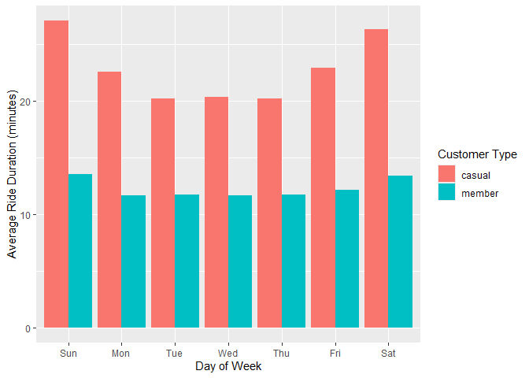
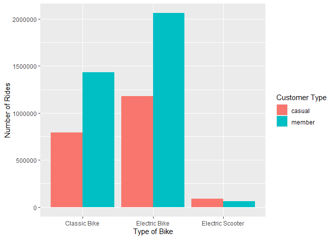

Cyclistic Case Study
================
Felipe Morales Osorio
2025-08-27

# Cyclistic Data Analysis Report

``` r
library(tidyverse)  #helps wrangle data
```

    ## ── Attaching core tidyverse packages ──────────────────────── tidyverse 2.0.0 ──
    ## ✔ dplyr     1.1.4     ✔ readr     2.1.5
    ## ✔ forcats   1.0.0     ✔ stringr   1.5.1
    ## ✔ ggplot2   3.5.2     ✔ tibble    3.3.0
    ## ✔ lubridate 1.9.4     ✔ tidyr     1.3.1
    ## ✔ purrr     1.1.0     
    ## ── Conflicts ────────────────────────────────────────── tidyverse_conflicts() ──
    ## ✖ dplyr::filter() masks stats::filter()
    ## ✖ dplyr::lag()    masks stats::lag()
    ## ℹ Use the conflicted package (<http://conflicted.r-lib.org/>) to force all conflicts to become errors

``` r
# Use the conflicted package to manage conflicts
library(conflicted)
```

### Set dplyr::filter and dplyr::lag as the default choices

``` r
conflict_prefer("filter", "dplyr")
```

    ## [conflicted] Will prefer dplyr::filter over any other package.

``` r
conflict_prefer("lag", "dplyr")
```

    ## [conflicted] Will prefer dplyr::lag over any other package.

## STEP 1: COLLECT DATA

``` r
# Divvy datasets uploaded here
tripdata_2025_07 <- read_csv("./Case Study Data/Original Data/2025-07-tripdata.csv")
```

    ## Rows: 763432 Columns: 13
    ## ── Column specification ────────────────────────────────────────────────────────
    ## Delimiter: ","
    ## chr  (7): ride_id, rideable_type, start_station_name, start_station_id, end_...
    ## dbl  (4): start_lat, start_lng, end_lat, end_lng
    ## dttm (2): started_at, ended_at
    ## 
    ## ℹ Use `spec()` to retrieve the full column specification for this data.
    ## ℹ Specify the column types or set `show_col_types = FALSE` to quiet this message.

``` r
tripdata_2025_06 <- read_csv("./Case Study Data/Original Data/2025-06-tripdata.csv")
```

    ## Rows: 678904 Columns: 13
    ## ── Column specification ────────────────────────────────────────────────────────
    ## Delimiter: ","
    ## chr  (7): ride_id, rideable_type, start_station_name, start_station_id, end_...
    ## dbl  (4): start_lat, start_lng, end_lat, end_lng
    ## dttm (2): started_at, ended_at
    ## 
    ## ℹ Use `spec()` to retrieve the full column specification for this data.
    ## ℹ Specify the column types or set `show_col_types = FALSE` to quiet this message.

``` r
tripdata_2025_05 <- read_csv("./Case Study Data/Original Data/2025-05-tripdata.csv")
```

    ## Rows: 502456 Columns: 13
    ## ── Column specification ────────────────────────────────────────────────────────
    ## Delimiter: ","
    ## chr  (7): ride_id, rideable_type, start_station_name, start_station_id, end_...
    ## dbl  (4): start_lat, start_lng, end_lat, end_lng
    ## dttm (2): started_at, ended_at
    ## 
    ## ℹ Use `spec()` to retrieve the full column specification for this data.
    ## ℹ Specify the column types or set `show_col_types = FALSE` to quiet this message.

``` r
tripdata_2025_04 <- read_csv("./Case Study Data/Original Data/2025-04-tripdata.csv")
```

    ## Rows: 371341 Columns: 13
    ## ── Column specification ────────────────────────────────────────────────────────
    ## Delimiter: ","
    ## chr  (7): ride_id, rideable_type, start_station_name, start_station_id, end_...
    ## dbl  (4): start_lat, start_lng, end_lat, end_lng
    ## dttm (2): started_at, ended_at
    ## 
    ## ℹ Use `spec()` to retrieve the full column specification for this data.
    ## ℹ Specify the column types or set `show_col_types = FALSE` to quiet this message.

``` r
tripdata_2025_03 <- read_csv("./Case Study Data/Original Data/2025-03-tripdata.csv")
```

    ## Rows: 298155 Columns: 13
    ## ── Column specification ────────────────────────────────────────────────────────
    ## Delimiter: ","
    ## chr  (7): ride_id, rideable_type, start_station_name, start_station_id, end_...
    ## dbl  (4): start_lat, start_lng, end_lat, end_lng
    ## dttm (2): started_at, ended_at
    ## 
    ## ℹ Use `spec()` to retrieve the full column specification for this data.
    ## ℹ Specify the column types or set `show_col_types = FALSE` to quiet this message.

``` r
tripdata_2025_02 <- read_csv("./Case Study Data/Original Data/2025-02-tripdata.csv")
```

    ## Rows: 151880 Columns: 13
    ## ── Column specification ────────────────────────────────────────────────────────
    ## Delimiter: ","
    ## chr  (7): ride_id, rideable_type, start_station_name, start_station_id, end_...
    ## dbl  (4): start_lat, start_lng, end_lat, end_lng
    ## dttm (2): started_at, ended_at
    ## 
    ## ℹ Use `spec()` to retrieve the full column specification for this data.
    ## ℹ Specify the column types or set `show_col_types = FALSE` to quiet this message.

``` r
tripdata_2025_01 <- read_csv("./Case Study Data/Original Data/2025-01-tripdata.csv")
```

    ## Rows: 138689 Columns: 13
    ## ── Column specification ────────────────────────────────────────────────────────
    ## Delimiter: ","
    ## chr  (7): ride_id, rideable_type, start_station_name, start_station_id, end_...
    ## dbl  (4): start_lat, start_lng, end_lat, end_lng
    ## dttm (2): started_at, ended_at
    ## 
    ## ℹ Use `spec()` to retrieve the full column specification for this data.
    ## ℹ Specify the column types or set `show_col_types = FALSE` to quiet this message.

``` r
tripdata_2024_12 <- read_csv("./Case Study Data/Original Data/2024-12-tripdata.csv")
```

    ## Rows: 178372 Columns: 13
    ## ── Column specification ────────────────────────────────────────────────────────
    ## Delimiter: ","
    ## chr  (7): ride_id, rideable_type, start_station_name, start_station_id, end_...
    ## dbl  (4): start_lat, start_lng, end_lat, end_lng
    ## dttm (2): started_at, ended_at
    ## 
    ## ℹ Use `spec()` to retrieve the full column specification for this data.
    ## ℹ Specify the column types or set `show_col_types = FALSE` to quiet this message.

``` r
tripdata_2024_11 <- read_csv("./Case Study Data/Original Data/2024-11-tripdata.csv")
```

    ## Rows: 335075 Columns: 13
    ## ── Column specification ────────────────────────────────────────────────────────
    ## Delimiter: ","
    ## chr  (7): ride_id, rideable_type, start_station_name, start_station_id, end_...
    ## dbl  (4): start_lat, start_lng, end_lat, end_lng
    ## dttm (2): started_at, ended_at
    ## 
    ## ℹ Use `spec()` to retrieve the full column specification for this data.
    ## ℹ Specify the column types or set `show_col_types = FALSE` to quiet this message.

``` r
tripdata_2024_10 <- read_csv("./Case Study Data/Original Data/2024-10-tripdata.csv")
```

    ## Rows: 616281 Columns: 13
    ## ── Column specification ────────────────────────────────────────────────────────
    ## Delimiter: ","
    ## chr  (7): ride_id, rideable_type, start_station_name, start_station_id, end_...
    ## dbl  (4): start_lat, start_lng, end_lat, end_lng
    ## dttm (2): started_at, ended_at
    ## 
    ## ℹ Use `spec()` to retrieve the full column specification for this data.
    ## ℹ Specify the column types or set `show_col_types = FALSE` to quiet this message.

``` r
tripdata_2024_09 <- read_csv("./Case Study Data/Original Data/2024-09-tripdata.csv")
```

    ## Rows: 821276 Columns: 13
    ## ── Column specification ────────────────────────────────────────────────────────
    ## Delimiter: ","
    ## chr  (7): ride_id, rideable_type, start_station_name, start_station_id, end_...
    ## dbl  (4): start_lat, start_lng, end_lat, end_lng
    ## dttm (2): started_at, ended_at
    ## 
    ## ℹ Use `spec()` to retrieve the full column specification for this data.
    ## ℹ Specify the column types or set `show_col_types = FALSE` to quiet this message.

``` r
tripdata_2024_08 <- read_csv("./Case Study Data/Original Data/2024-08-tripdata.csv")
```

    ## Rows: 755639 Columns: 13
    ## ── Column specification ────────────────────────────────────────────────────────
    ## Delimiter: ","
    ## chr  (7): ride_id, rideable_type, start_station_name, start_station_id, end_...
    ## dbl  (4): start_lat, start_lng, end_lat, end_lng
    ## dttm (2): started_at, ended_at
    ## 
    ## ℹ Use `spec()` to retrieve the full column specification for this data.
    ## ℹ Specify the column types or set `show_col_types = FALSE` to quiet this message.

## STEP 2: WRANGLE DATA AND COMBINE INTO A SINGLE FILE

### Compare column names each of the files.

While the names don’t have to be in the same order, they DO need to
match perfectly before we can use a command to join them into one file

``` r
colnames(tripdata_2025_07)
```

    ##  [1] "ride_id"            "rideable_type"      "started_at"        
    ##  [4] "ended_at"           "start_station_name" "start_station_id"  
    ##  [7] "end_station_name"   "end_station_id"     "start_lat"         
    ## [10] "start_lng"          "end_lat"            "end_lng"           
    ## [13] "member_casual"

``` r
colnames(tripdata_2025_06)
```

    ##  [1] "ride_id"            "rideable_type"      "started_at"        
    ##  [4] "ended_at"           "start_station_name" "start_station_id"  
    ##  [7] "end_station_name"   "end_station_id"     "start_lat"         
    ## [10] "start_lng"          "end_lat"            "end_lng"           
    ## [13] "member_casual"

``` r
colnames(tripdata_2025_05)
```

    ##  [1] "ride_id"            "rideable_type"      "started_at"        
    ##  [4] "ended_at"           "start_station_name" "start_station_id"  
    ##  [7] "end_station_name"   "end_station_id"     "start_lat"         
    ## [10] "start_lng"          "end_lat"            "end_lng"           
    ## [13] "member_casual"

``` r
colnames(tripdata_2025_04)
```

    ##  [1] "ride_id"            "rideable_type"      "started_at"        
    ##  [4] "ended_at"           "start_station_name" "start_station_id"  
    ##  [7] "end_station_name"   "end_station_id"     "start_lat"         
    ## [10] "start_lng"          "end_lat"            "end_lng"           
    ## [13] "member_casual"

``` r
colnames(tripdata_2025_03)
```

    ##  [1] "ride_id"            "rideable_type"      "started_at"        
    ##  [4] "ended_at"           "start_station_name" "start_station_id"  
    ##  [7] "end_station_name"   "end_station_id"     "start_lat"         
    ## [10] "start_lng"          "end_lat"            "end_lng"           
    ## [13] "member_casual"

``` r
colnames(tripdata_2025_02)
```

    ##  [1] "ride_id"            "rideable_type"      "started_at"        
    ##  [4] "ended_at"           "start_station_name" "start_station_id"  
    ##  [7] "end_station_name"   "end_station_id"     "start_lat"         
    ## [10] "start_lng"          "end_lat"            "end_lng"           
    ## [13] "member_casual"

``` r
colnames(tripdata_2025_01)
```

    ##  [1] "ride_id"            "rideable_type"      "started_at"        
    ##  [4] "ended_at"           "start_station_name" "start_station_id"  
    ##  [7] "end_station_name"   "end_station_id"     "start_lat"         
    ## [10] "start_lng"          "end_lat"            "end_lng"           
    ## [13] "member_casual"

``` r
colnames(tripdata_2024_12)
```

    ##  [1] "ride_id"            "rideable_type"      "started_at"        
    ##  [4] "ended_at"           "start_station_name" "start_station_id"  
    ##  [7] "end_station_name"   "end_station_id"     "start_lat"         
    ## [10] "start_lng"          "end_lat"            "end_lng"           
    ## [13] "member_casual"

``` r
colnames(tripdata_2024_11)
```

    ##  [1] "ride_id"            "rideable_type"      "started_at"        
    ##  [4] "ended_at"           "start_station_name" "start_station_id"  
    ##  [7] "end_station_name"   "end_station_id"     "start_lat"         
    ## [10] "start_lng"          "end_lat"            "end_lng"           
    ## [13] "member_casual"

``` r
colnames(tripdata_2024_10)
```

    ##  [1] "ride_id"            "rideable_type"      "started_at"        
    ##  [4] "ended_at"           "start_station_name" "start_station_id"  
    ##  [7] "end_station_name"   "end_station_id"     "start_lat"         
    ## [10] "start_lng"          "end_lat"            "end_lng"           
    ## [13] "member_casual"

``` r
colnames(tripdata_2024_09)
```

    ##  [1] "ride_id"            "rideable_type"      "started_at"        
    ##  [4] "ended_at"           "start_station_name" "start_station_id"  
    ##  [7] "end_station_name"   "end_station_id"     "start_lat"         
    ## [10] "start_lng"          "end_lat"            "end_lng"           
    ## [13] "member_casual"

``` r
colnames(tripdata_2024_08)
```

    ##  [1] "ride_id"            "rideable_type"      "started_at"        
    ##  [4] "ended_at"           "start_station_name" "start_station_id"  
    ##  [7] "end_station_name"   "end_station_id"     "start_lat"         
    ## [10] "start_lng"          "end_lat"            "end_lng"           
    ## [13] "member_casual"

### Rename columns to make them consistent if needed

In this case no renaming is needed but an example of how to do it if
needed is found below. This assumes that q1_2019 needs renaming.

(q1_2019 \<- rename(q1_2019 ,ride_id = trip_id ,rideable_type = bikeid
,started_at = start_time ,ended_at = end_time ,start_station_name =
from_station_name ,start_station_id = from_station_id ,end_station_name
= to_station_name ,end_station_id = to_station_id ,member_casual =
usertype ))

### Inspect the dataframes and look for incongruencies

``` r
str(tripdata_2025_07)
```

    ## spc_tbl_ [763,432 × 13] (S3: spec_tbl_df/tbl_df/tbl/data.frame)
    ##  $ ride_id           : chr [1:763432] "455D43BD91D73437" "9D4A6B723ECD98CA" "C57044CF523302ED" "AFD35552E6685B6E" ...
    ##  $ rideable_type     : chr [1:763432] "classic_bike" "classic_bike" "classic_bike" "electric_bike" ...
    ##  $ started_at        : POSIXct[1:763432], format: "2025-07-05 17:15:08" "2025-07-01 13:57:38" ...
    ##  $ ended_at          : POSIXct[1:763432], format: "2025-07-05 17:25:47" "2025-07-01 14:06:35" ...
    ##  $ start_station_name: chr [1:763432] "Lincoln Ave & Diversey Pkwy" "Cottage Grove Ave & Oakwood Blvd" "Theater on the Lake" "Pine Grove Ave & Waveland Ave" ...
    ##  $ start_station_id  : chr [1:763432] "CHI00285" "CHI00400" "CHI00420" "CHI00354" ...
    ##  $ end_station_name  : chr [1:763432] "Lincoln Ave & Addison St" "Cottage Grove Ave & 47th St" "Winthrop Ave & Lawrence Ave" "Winthrop Ave & Lawrence Ave" ...
    ##  $ end_station_id    : chr [1:763432] "CHI00478" "CHI00488" "CHI00391" "CHI00391" ...
    ##  $ start_lat         : num [1:763432] 41.9 41.8 41.9 41.9 41.9 ...
    ##  $ start_lng         : num [1:763432] -87.7 -87.6 -87.6 -87.6 -87.6 ...
    ##  $ end_lat           : num [1:763432] 41.9 41.8 42 42 41.9 ...
    ##  $ end_lng           : num [1:763432] -87.7 -87.6 -87.7 -87.7 -87.7 ...
    ##  $ member_casual     : chr [1:763432] "member" "member" "member" "member" ...
    ##  - attr(*, "spec")=
    ##   .. cols(
    ##   ..   ride_id = col_character(),
    ##   ..   rideable_type = col_character(),
    ##   ..   started_at = col_datetime(format = ""),
    ##   ..   ended_at = col_datetime(format = ""),
    ##   ..   start_station_name = col_character(),
    ##   ..   start_station_id = col_character(),
    ##   ..   end_station_name = col_character(),
    ##   ..   end_station_id = col_character(),
    ##   ..   start_lat = col_double(),
    ##   ..   start_lng = col_double(),
    ##   ..   end_lat = col_double(),
    ##   ..   end_lng = col_double(),
    ##   ..   member_casual = col_character()
    ##   .. )
    ##  - attr(*, "problems")=<externalptr>

``` r
str(tripdata_2025_06)
```

    ## spc_tbl_ [678,904 × 13] (S3: spec_tbl_df/tbl_df/tbl/data.frame)
    ##  $ ride_id           : chr [1:678904] "0E43949BF937C7DA" "1CDEA40FEAF21789" "7ECEB1638575575C" "F275084E25F5A131" ...
    ##  $ rideable_type     : chr [1:678904] "electric_bike" "classic_bike" "classic_bike" "electric_bike" ...
    ##  $ started_at        : POSIXct[1:678904], format: "2025-06-05 21:24:56" "2025-06-14 13:03:34" ...
    ##  $ ended_at          : POSIXct[1:678904], format: "2025-06-05 21:38:44" "2025-06-14 13:13:19" ...
    ##  $ start_station_name: chr [1:678904] "Clark St & Armitage Ave" "Dearborn Pkwy & Delaware Pl" "Dearborn Pkwy & Delaware Pl" "Clark St & Elm St" ...
    ##  $ start_station_id  : chr [1:678904] "CHI00474" "CHI00306" "CHI00306" "CHI00281" ...
    ##  $ end_station_name  : chr [1:678904] "Dearborn Pkwy & Delaware Pl" "Kingsbury St & Kinzie St" "Kingsbury St & Kinzie St" NA ...
    ##  $ end_station_id    : chr [1:678904] "CHI00306" "CHI00299" "CHI00299" NA ...
    ##  $ start_lat         : num [1:678904] 41.9 41.9 41.9 41.9 41.9 ...
    ##  $ start_lng         : num [1:678904] -87.6 -87.6 -87.6 -87.6 -87.7 ...
    ##  $ end_lat           : num [1:678904] 41.9 41.9 41.9 41.9 41.9 ...
    ##  $ end_lng           : num [1:678904] -87.6 -87.6 -87.6 -87.7 -87.7 ...
    ##  $ member_casual     : chr [1:678904] "member" "member" "member" "member" ...
    ##  - attr(*, "spec")=
    ##   .. cols(
    ##   ..   ride_id = col_character(),
    ##   ..   rideable_type = col_character(),
    ##   ..   started_at = col_datetime(format = ""),
    ##   ..   ended_at = col_datetime(format = ""),
    ##   ..   start_station_name = col_character(),
    ##   ..   start_station_id = col_character(),
    ##   ..   end_station_name = col_character(),
    ##   ..   end_station_id = col_character(),
    ##   ..   start_lat = col_double(),
    ##   ..   start_lng = col_double(),
    ##   ..   end_lat = col_double(),
    ##   ..   end_lng = col_double(),
    ##   ..   member_casual = col_character()
    ##   .. )
    ##  - attr(*, "problems")=<externalptr>

``` r
str(tripdata_2025_05)
```

    ## spc_tbl_ [502,456 × 13] (S3: spec_tbl_df/tbl_df/tbl/data.frame)
    ##  $ ride_id           : chr [1:502456] "BADF67E2C5058F19" "0210AE485D59C8C5" "5E68FE5B9283E4C4" "13D2DCD6FB872858" ...
    ##  $ rideable_type     : chr [1:502456] "classic_bike" "electric_bike" "classic_bike" "classic_bike" ...
    ##  $ started_at        : POSIXct[1:502456], format: "2025-05-11 17:22:39" "2025-05-05 08:02:09" ...
    ##  $ ended_at          : POSIXct[1:502456], format: "2025-05-11 18:11:19" "2025-05-05 08:12:07" ...
    ##  $ start_station_name: chr [1:502456] "DuSable Lake Shore Dr & North Blvd" "Damen Ave & Grand Ave" "LaSalle St & Illinois St" "Milwaukee Ave & Rockwell St" ...
    ##  $ start_station_id  : chr [1:502456] "LF-005" "TA1308000006" "13430" "13242" ...
    ##  $ end_station_name  : chr [1:502456] "Winthrop Ave & Lawrence Ave" "Desplaines St & Jackson Blvd" "Clark St & Elm St" "Damen Ave & Cortland St" ...
    ##  $ end_station_id    : chr [1:502456] "TA1308000021" "15539" "TA1307000039" "13133" ...
    ##  $ start_lat         : num [1:502456] 41.9 41.9 41.9 41.9 41.9 ...
    ##  $ start_lng         : num [1:502456] -87.6 -87.7 -87.6 -87.7 -87.6 ...
    ##  $ end_lat           : num [1:502456] 42 41.9 41.9 41.9 41.9 ...
    ##  $ end_lng           : num [1:502456] -87.7 -87.6 -87.6 -87.7 -87.6 ...
    ##  $ member_casual     : chr [1:502456] "member" "member" "member" "member" ...
    ##  - attr(*, "spec")=
    ##   .. cols(
    ##   ..   ride_id = col_character(),
    ##   ..   rideable_type = col_character(),
    ##   ..   started_at = col_datetime(format = ""),
    ##   ..   ended_at = col_datetime(format = ""),
    ##   ..   start_station_name = col_character(),
    ##   ..   start_station_id = col_character(),
    ##   ..   end_station_name = col_character(),
    ##   ..   end_station_id = col_character(),
    ##   ..   start_lat = col_double(),
    ##   ..   start_lng = col_double(),
    ##   ..   end_lat = col_double(),
    ##   ..   end_lng = col_double(),
    ##   ..   member_casual = col_character()
    ##   .. )
    ##  - attr(*, "problems")=<externalptr>

``` r
str(tripdata_2025_04)
```

    ## spc_tbl_ [371,341 × 13] (S3: spec_tbl_df/tbl_df/tbl/data.frame)
    ##  $ ride_id           : chr [1:371341] "AF3863596DF9D94B" "8B38081EBE918800" "1C7F1DE826BBBC8D" "CAD23D69A79A6C3B" ...
    ##  $ rideable_type     : chr [1:371341] "classic_bike" "electric_bike" "electric_bike" "classic_bike" ...
    ##  $ started_at        : POSIXct[1:371341], format: "2025-04-27 14:29:34" "2025-04-23 17:48:51" ...
    ##  $ ended_at          : POSIXct[1:371341], format: "2025-04-27 14:36:23" "2025-04-23 17:59:06" ...
    ##  $ start_station_name: chr [1:371341] "Troy St & Elston Ave" "Wabash Ave & Adams St" "Damen Ave & Cortland St" "Clark St & Elm St" ...
    ##  $ start_station_id  : chr [1:371341] "15631" "KA1503000015" "13133" "TA1307000039" ...
    ##  $ end_station_name  : chr [1:371341] "Richmond St & Diversey Ave" "Green St & Madison St" "California Ave & Fletcher St" "Orleans St & Merchandise Mart Plaza" ...
    ##  $ end_station_id    : chr [1:371341] "15645" "TA1307000120" "15642" "TA1305000022" ...
    ##  $ start_lat         : num [1:371341] 41.9 41.9 41.9 41.9 41.9 ...
    ##  $ start_lng         : num [1:371341] -87.7 -87.6 -87.7 -87.6 -87.7 ...
    ##  $ end_lat           : num [1:371341] 41.9 41.9 41.9 41.9 41.9 ...
    ##  $ end_lng           : num [1:371341] -87.7 -87.6 -87.7 -87.6 -87.7 ...
    ##  $ member_casual     : chr [1:371341] "member" "member" "member" "member" ...
    ##  - attr(*, "spec")=
    ##   .. cols(
    ##   ..   ride_id = col_character(),
    ##   ..   rideable_type = col_character(),
    ##   ..   started_at = col_datetime(format = ""),
    ##   ..   ended_at = col_datetime(format = ""),
    ##   ..   start_station_name = col_character(),
    ##   ..   start_station_id = col_character(),
    ##   ..   end_station_name = col_character(),
    ##   ..   end_station_id = col_character(),
    ##   ..   start_lat = col_double(),
    ##   ..   start_lng = col_double(),
    ##   ..   end_lat = col_double(),
    ##   ..   end_lng = col_double(),
    ##   ..   member_casual = col_character()
    ##   .. )
    ##  - attr(*, "problems")=<externalptr>

``` r
str(tripdata_2025_03)
```

    ## spc_tbl_ [298,155 × 13] (S3: spec_tbl_df/tbl_df/tbl/data.frame)
    ##  $ ride_id           : chr [1:298155] "16CBE9844D401954" "1CB408029E2B5F74" "7B6A76CD0F204D08" "4F7084E3D75CDE31" ...
    ##  $ rideable_type     : chr [1:298155] "electric_bike" "electric_bike" "electric_bike" "electric_bike" ...
    ##  $ started_at        : POSIXct[1:298155], format: "2025-03-18 08:39:20" "2025-03-24 16:04:22" ...
    ##  $ ended_at          : POSIXct[1:298155], format: "2025-03-18 08:51:37" "2025-03-24 16:27:41" ...
    ##  $ start_station_name: chr [1:298155] NA NA NA NA ...
    ##  $ start_station_id  : chr [1:298155] NA NA NA NA ...
    ##  $ end_station_name  : chr [1:298155] "Canal St & Jackson Blvd" "Albany Ave & Bloomingdale Ave" "Albany Ave & Bloomingdale Ave" "Canal St & Jackson Blvd" ...
    ##  $ end_station_id    : chr [1:298155] "13138" "15655" "15655" "13138" ...
    ##  $ start_lat         : num [1:298155] 41.9 41.9 41.9 41.9 41.9 ...
    ##  $ start_lng         : num [1:298155] -87.7 -87.7 -87.7 -87.6 -87.7 ...
    ##  $ end_lat           : num [1:298155] 41.9 41.9 41.9 41.9 41.9 ...
    ##  $ end_lng           : num [1:298155] -87.6 -87.7 -87.7 -87.6 -87.7 ...
    ##  $ member_casual     : chr [1:298155] "member" "member" "member" "member" ...
    ##  - attr(*, "spec")=
    ##   .. cols(
    ##   ..   ride_id = col_character(),
    ##   ..   rideable_type = col_character(),
    ##   ..   started_at = col_datetime(format = ""),
    ##   ..   ended_at = col_datetime(format = ""),
    ##   ..   start_station_name = col_character(),
    ##   ..   start_station_id = col_character(),
    ##   ..   end_station_name = col_character(),
    ##   ..   end_station_id = col_character(),
    ##   ..   start_lat = col_double(),
    ##   ..   start_lng = col_double(),
    ##   ..   end_lat = col_double(),
    ##   ..   end_lng = col_double(),
    ##   ..   member_casual = col_character()
    ##   .. )
    ##  - attr(*, "problems")=<externalptr>

``` r
str(tripdata_2025_02)
```

    ## spc_tbl_ [151,880 × 13] (S3: spec_tbl_df/tbl_df/tbl/data.frame)
    ##  $ ride_id           : chr [1:151880] "A246CA24873F7C5C" "303C0906F3F068AE" "A0F65F3531F1FB2B" "CE663C815B6A6D73" ...
    ##  $ rideable_type     : chr [1:151880] "classic_bike" "classic_bike" "electric_bike" "electric_bike" ...
    ##  $ started_at        : POSIXct[1:151880], format: "2025-02-25 21:21:21" "2025-02-08 14:55:13" ...
    ##  $ ended_at          : POSIXct[1:151880], format: "2025-02-25 21:30:09" "2025-02-08 15:13:39" ...
    ##  $ start_station_name: chr [1:151880] "Michigan Ave & Lake St" "Ogden Ave & Race Ave" "Michigan Ave & Lake St" "Ogden Ave & Race Ave" ...
    ##  $ start_station_id  : chr [1:151880] "TA1305000011" "13194" "TA1305000011" "13194" ...
    ##  $ end_station_name  : chr [1:151880] "Clark St & Elm St" "Clark St & Elm St" "Wabash Ave & 9th St" "Clark St & Elm St" ...
    ##  $ end_station_id    : chr [1:151880] "TA1307000039" "TA1307000039" "TA1309000010" "TA1307000039" ...
    ##  $ start_lat         : num [1:151880] 41.9 41.9 41.9 41.9 41.9 ...
    ##  $ start_lng         : num [1:151880] -87.6 -87.7 -87.6 -87.7 -87.6 ...
    ##  $ end_lat           : num [1:151880] 41.9 41.9 41.9 41.9 41.9 ...
    ##  $ end_lng           : num [1:151880] -87.6 -87.6 -87.6 -87.6 -87.6 ...
    ##  $ member_casual     : chr [1:151880] "member" "member" "casual" "casual" ...
    ##  - attr(*, "spec")=
    ##   .. cols(
    ##   ..   ride_id = col_character(),
    ##   ..   rideable_type = col_character(),
    ##   ..   started_at = col_datetime(format = ""),
    ##   ..   ended_at = col_datetime(format = ""),
    ##   ..   start_station_name = col_character(),
    ##   ..   start_station_id = col_character(),
    ##   ..   end_station_name = col_character(),
    ##   ..   end_station_id = col_character(),
    ##   ..   start_lat = col_double(),
    ##   ..   start_lng = col_double(),
    ##   ..   end_lat = col_double(),
    ##   ..   end_lng = col_double(),
    ##   ..   member_casual = col_character()
    ##   .. )
    ##  - attr(*, "problems")=<externalptr>

``` r
str(tripdata_2025_01)
```

    ## spc_tbl_ [138,689 × 13] (S3: spec_tbl_df/tbl_df/tbl/data.frame)
    ##  $ ride_id           : chr [1:138689] "7569BC890583FCD7" "013609308856B7FC" "EACACD3CE0607C0D" "EAA2485BA64710D3" ...
    ##  $ rideable_type     : chr [1:138689] "classic_bike" "electric_bike" "classic_bike" "classic_bike" ...
    ##  $ started_at        : POSIXct[1:138689], format: "2025-01-21 17:23:54" "2025-01-11 15:44:06" ...
    ##  $ ended_at          : POSIXct[1:138689], format: "2025-01-21 17:37:52" "2025-01-11 15:49:11" ...
    ##  $ start_station_name: chr [1:138689] "Wacker Dr & Washington St" "Halsted St & Wrightwood Ave" "Southport Ave & Waveland Ave" "Southport Ave & Waveland Ave" ...
    ##  $ start_station_id  : chr [1:138689] "KA1503000072" "TA1309000061" "13235" "13235" ...
    ##  $ end_station_name  : chr [1:138689] "McClurg Ct & Ohio St" "Racine Ave & Belmont Ave" "Broadway & Cornelia Ave" "Southport Ave & Roscoe St" ...
    ##  $ end_station_id    : chr [1:138689] "TA1306000029" "TA1308000019" "13278" "13071" ...
    ##  $ start_lat         : num [1:138689] 41.9 41.9 41.9 41.9 41.9 ...
    ##  $ start_lng         : num [1:138689] -87.6 -87.6 -87.7 -87.7 -87.7 ...
    ##  $ end_lat           : num [1:138689] 41.9 41.9 41.9 41.9 41.9 ...
    ##  $ end_lng           : num [1:138689] -87.6 -87.7 -87.6 -87.7 -87.7 ...
    ##  $ member_casual     : chr [1:138689] "member" "member" "member" "member" ...
    ##  - attr(*, "spec")=
    ##   .. cols(
    ##   ..   ride_id = col_character(),
    ##   ..   rideable_type = col_character(),
    ##   ..   started_at = col_datetime(format = ""),
    ##   ..   ended_at = col_datetime(format = ""),
    ##   ..   start_station_name = col_character(),
    ##   ..   start_station_id = col_character(),
    ##   ..   end_station_name = col_character(),
    ##   ..   end_station_id = col_character(),
    ##   ..   start_lat = col_double(),
    ##   ..   start_lng = col_double(),
    ##   ..   end_lat = col_double(),
    ##   ..   end_lng = col_double(),
    ##   ..   member_casual = col_character()
    ##   .. )
    ##  - attr(*, "problems")=<externalptr>

``` r
str(tripdata_2024_12)
```

    ## spc_tbl_ [178,372 × 13] (S3: spec_tbl_df/tbl_df/tbl/data.frame)
    ##  $ ride_id           : chr [1:178372] "6C960DEB4F78854E" "C0913EEB2834E7A2" "848A37DD4723078A" "3FA09C762ECB48BD" ...
    ##  $ rideable_type     : chr [1:178372] "electric_bike" "classic_bike" "classic_bike" "electric_bike" ...
    ##  $ started_at        : POSIXct[1:178372], format: "2024-12-31 01:38:35" "2024-12-21 18:41:26" ...
    ##  $ ended_at          : POSIXct[1:178372], format: "2024-12-31 01:48:45" "2024-12-21 18:47:33" ...
    ##  $ start_station_name: chr [1:178372] "Halsted St & Roscoe St" "Clark St & Wellington Ave" "Sheridan Rd & Montrose Ave" "Aberdeen St & Jackson Blvd" ...
    ##  $ start_station_id  : chr [1:178372] "TA1309000025" "TA1307000136" "TA1307000107" "13157" ...
    ##  $ end_station_name  : chr [1:178372] "Clark St & Winnemac Ave" "Halsted St & Roscoe St" "Broadway & Barry Ave" "Green St & Randolph St*" ...
    ##  $ end_station_id    : chr [1:178372] "TA1309000035" "TA1309000025" "13137" "chargingstx3" ...
    ##  $ start_lat         : num [1:178372] 41.9 41.9 42 41.9 41.9 ...
    ##  $ start_lng         : num [1:178372] -87.6 -87.6 -87.7 -87.7 -87.7 ...
    ##  $ end_lat           : num [1:178372] 42 41.9 41.9 41.9 41.9 ...
    ##  $ end_lng           : num [1:178372] -87.7 -87.6 -87.6 -87.6 -87.7 ...
    ##  $ member_casual     : chr [1:178372] "member" "member" "member" "member" ...
    ##  - attr(*, "spec")=
    ##   .. cols(
    ##   ..   ride_id = col_character(),
    ##   ..   rideable_type = col_character(),
    ##   ..   started_at = col_datetime(format = ""),
    ##   ..   ended_at = col_datetime(format = ""),
    ##   ..   start_station_name = col_character(),
    ##   ..   start_station_id = col_character(),
    ##   ..   end_station_name = col_character(),
    ##   ..   end_station_id = col_character(),
    ##   ..   start_lat = col_double(),
    ##   ..   start_lng = col_double(),
    ##   ..   end_lat = col_double(),
    ##   ..   end_lng = col_double(),
    ##   ..   member_casual = col_character()
    ##   .. )
    ##  - attr(*, "problems")=<externalptr>

``` r
str(tripdata_2024_11)
```

    ## spc_tbl_ [335,075 × 13] (S3: spec_tbl_df/tbl_df/tbl/data.frame)
    ##  $ ride_id           : chr [1:335075] "578DDD7CE1771FFA" "78B141C50102ABA6" "1E794CF36394E2D7" "E5DD2CAB58D73F98" ...
    ##  $ rideable_type     : chr [1:335075] "classic_bike" "classic_bike" "classic_bike" "classic_bike" ...
    ##  $ started_at        : POSIXct[1:335075], format: "2024-11-07 19:21:58" "2024-11-22 14:49:00" ...
    ##  $ ended_at          : POSIXct[1:335075], format: "2024-11-07 19:28:57" "2024-11-22 14:56:15" ...
    ##  $ start_station_name: chr [1:335075] "Walsh Park" "Walsh Park" "Walsh Park" "Clark St & Elm St" ...
    ##  $ start_station_id  : chr [1:335075] "18067" "18067" "18067" "TA1307000039" ...
    ##  $ end_station_name  : chr [1:335075] "Leavitt St & North Ave" "Leavitt St & Armitage Ave" "Damen Ave & Cortland St" "Clark St & Drummond Pl" ...
    ##  $ end_station_id    : chr [1:335075] "TA1308000005" "TA1309000029" "13133" "TA1307000142" ...
    ##  $ start_lat         : num [1:335075] 41.9 41.9 41.9 41.9 41.9 ...
    ##  $ start_lng         : num [1:335075] -87.7 -87.7 -87.7 -87.6 -87.6 ...
    ##  $ end_lat           : num [1:335075] 41.9 41.9 41.9 41.9 41.9 ...
    ##  $ end_lng           : num [1:335075] -87.7 -87.7 -87.7 -87.6 -87.6 ...
    ##  $ member_casual     : chr [1:335075] "member" "member" "member" "member" ...
    ##  - attr(*, "spec")=
    ##   .. cols(
    ##   ..   ride_id = col_character(),
    ##   ..   rideable_type = col_character(),
    ##   ..   started_at = col_datetime(format = ""),
    ##   ..   ended_at = col_datetime(format = ""),
    ##   ..   start_station_name = col_character(),
    ##   ..   start_station_id = col_character(),
    ##   ..   end_station_name = col_character(),
    ##   ..   end_station_id = col_character(),
    ##   ..   start_lat = col_double(),
    ##   ..   start_lng = col_double(),
    ##   ..   end_lat = col_double(),
    ##   ..   end_lng = col_double(),
    ##   ..   member_casual = col_character()
    ##   .. )
    ##  - attr(*, "problems")=<externalptr>

``` r
str(tripdata_2024_10)
```

    ## spc_tbl_ [616,281 × 13] (S3: spec_tbl_df/tbl_df/tbl/data.frame)
    ##  $ ride_id           : chr [1:616281] "4422E707103AA4FF" "19DB722B44CBE82F" "20AE2509FD68C939" "D0F17580AB9515A9" ...
    ##  $ rideable_type     : chr [1:616281] "electric_bike" "electric_bike" "electric_bike" "electric_bike" ...
    ##  $ started_at        : POSIXct[1:616281], format: "2024-10-14 03:26:04" "2024-10-13 19:33:38" ...
    ##  $ ended_at          : POSIXct[1:616281], format: "2024-10-14 03:32:56" "2024-10-13 19:39:04" ...
    ##  $ start_station_name: chr [1:616281] NA NA NA NA ...
    ##  $ start_station_id  : chr [1:616281] NA NA NA NA ...
    ##  $ end_station_name  : chr [1:616281] NA NA NA NA ...
    ##  $ end_station_id    : chr [1:616281] NA NA NA NA ...
    ##  $ start_lat         : num [1:616281] 42 42 42 42 42 ...
    ##  $ start_lng         : num [1:616281] -87.7 -87.7 -87.7 -87.7 -87.7 ...
    ##  $ end_lat           : num [1:616281] 42 42 42 42 42 ...
    ##  $ end_lng           : num [1:616281] -87.7 -87.7 -87.7 -87.7 -87.7 ...
    ##  $ member_casual     : chr [1:616281] "member" "member" "member" "member" ...
    ##  - attr(*, "spec")=
    ##   .. cols(
    ##   ..   ride_id = col_character(),
    ##   ..   rideable_type = col_character(),
    ##   ..   started_at = col_datetime(format = ""),
    ##   ..   ended_at = col_datetime(format = ""),
    ##   ..   start_station_name = col_character(),
    ##   ..   start_station_id = col_character(),
    ##   ..   end_station_name = col_character(),
    ##   ..   end_station_id = col_character(),
    ##   ..   start_lat = col_double(),
    ##   ..   start_lng = col_double(),
    ##   ..   end_lat = col_double(),
    ##   ..   end_lng = col_double(),
    ##   ..   member_casual = col_character()
    ##   .. )
    ##  - attr(*, "problems")=<externalptr>

``` r
str(tripdata_2024_09)
```

    ## spc_tbl_ [821,276 × 13] (S3: spec_tbl_df/tbl_df/tbl/data.frame)
    ##  $ ride_id           : chr [1:821276] "31D38723D5A8665A" "67CB39987F4E895B" "DA61204FD26EC681" "06F160D46AF235DD" ...
    ##  $ rideable_type     : chr [1:821276] "electric_bike" "electric_bike" "electric_bike" "electric_bike" ...
    ##  $ started_at        : POSIXct[1:821276], format: "2024-09-26 15:30:58" "2024-09-26 15:31:32" ...
    ##  $ ended_at          : POSIXct[1:821276], format: "2024-09-26 15:30:59" "2024-09-26 15:53:13" ...
    ##  $ start_station_name: chr [1:821276] NA NA NA NA ...
    ##  $ start_station_id  : chr [1:821276] NA NA NA NA ...
    ##  $ end_station_name  : chr [1:821276] NA NA NA NA ...
    ##  $ end_station_id    : chr [1:821276] NA NA NA NA ...
    ##  $ start_lat         : num [1:821276] 41.9 41.9 41.9 41.9 41.9 ...
    ##  $ start_lng         : num [1:821276] -87.6 -87.6 -87.6 -87.6 -87.7 ...
    ##  $ end_lat           : num [1:821276] 41.9 41.9 41.9 41.9 41.9 ...
    ##  $ end_lng           : num [1:821276] -87.6 -87.6 -87.6 -87.6 -87.6 ...
    ##  $ member_casual     : chr [1:821276] "member" "member" "member" "member" ...
    ##  - attr(*, "spec")=
    ##   .. cols(
    ##   ..   ride_id = col_character(),
    ##   ..   rideable_type = col_character(),
    ##   ..   started_at = col_datetime(format = ""),
    ##   ..   ended_at = col_datetime(format = ""),
    ##   ..   start_station_name = col_character(),
    ##   ..   start_station_id = col_character(),
    ##   ..   end_station_name = col_character(),
    ##   ..   end_station_id = col_character(),
    ##   ..   start_lat = col_double(),
    ##   ..   start_lng = col_double(),
    ##   ..   end_lat = col_double(),
    ##   ..   end_lng = col_double(),
    ##   ..   member_casual = col_character()
    ##   .. )
    ##  - attr(*, "problems")=<externalptr>

``` r
str(tripdata_2024_08)
```

    ## spc_tbl_ [755,639 × 13] (S3: spec_tbl_df/tbl_df/tbl/data.frame)
    ##  $ ride_id           : chr [1:755639] "BAA154388A869E64" "8752245932EFF67A" "44DDF9F57A9A161F" "44AAAF069B0C78C3" ...
    ##  $ rideable_type     : chr [1:755639] "classic_bike" "electric_bike" "classic_bike" "electric_bike" ...
    ##  $ started_at        : POSIXct[1:755639], format: "2024-08-02 13:35:14" "2024-08-02 15:33:13" ...
    ##  $ ended_at          : POSIXct[1:755639], format: "2024-08-02 13:48:24" "2024-08-02 15:55:23" ...
    ##  $ start_station_name: chr [1:755639] "State St & Randolph St" "Franklin St & Monroe St" "Franklin St & Monroe St" "Clark St & Elm St" ...
    ##  $ start_station_id  : chr [1:755639] "TA1305000029" "TA1309000007" "TA1309000007" "TA1307000039" ...
    ##  $ end_station_name  : chr [1:755639] "Wabash Ave & 9th St" "Damen Ave & Cortland St" "Clark St & Elm St" "McClurg Ct & Ohio St" ...
    ##  $ end_station_id    : chr [1:755639] "TA1309000010" "13133" "TA1307000039" "TA1306000029" ...
    ##  $ start_lat         : num [1:755639] 41.9 41.9 41.9 41.9 42 ...
    ##  $ start_lng         : num [1:755639] -87.6 -87.6 -87.6 -87.6 -87.7 ...
    ##  $ end_lat           : num [1:755639] 41.9 41.9 41.9 41.9 42 ...
    ##  $ end_lng           : num [1:755639] -87.6 -87.7 -87.6 -87.6 -87.7 ...
    ##  $ member_casual     : chr [1:755639] "member" "member" "member" "member" ...
    ##  - attr(*, "spec")=
    ##   .. cols(
    ##   ..   ride_id = col_character(),
    ##   ..   rideable_type = col_character(),
    ##   ..   started_at = col_datetime(format = ""),
    ##   ..   ended_at = col_datetime(format = ""),
    ##   ..   start_station_name = col_character(),
    ##   ..   start_station_id = col_character(),
    ##   ..   end_station_name = col_character(),
    ##   ..   end_station_id = col_character(),
    ##   ..   start_lat = col_double(),
    ##   ..   start_lng = col_double(),
    ##   ..   end_lat = col_double(),
    ##   ..   end_lng = col_double(),
    ##   ..   member_casual = col_character()
    ##   .. )
    ##  - attr(*, "problems")=<externalptr>

### Convert columns so that they can stack correctly

In this case, this is not necessary but below is an example of how to do
it if needed. This assumes ride_id and rideable_type need to be
converted to character types from the q1_2019 data frame.

q1_2019 \<- mutate(q1_2019, ride_id = as.character(ride_id)
,rideable_type = as.character(rideable_type))

### Stack individual monthly data frames into one big annual data frame

``` r
annual_tripdata <- bind_rows(tripdata_2025_07, tripdata_2025_06, tripdata_2025_05, tripdata_2025_04, tripdata_2025_03, tripdata_2025_02, tripdata_2025_01, tripdata_2024_12, tripdata_2024_11, tripdata_2024_10, tripdata_2024_09, tripdata_2024_08)
```

### Remove fields or columns that are not needed

The longitude and latitude data was removed as well as the information
about the station names. This was done using the dpylr select method.

``` r
annual_tripdata <- annual_tripdata %>%  
  select(-c(start_station_name, start_station_id, end_station_name, end_station_id, start_lat, start_lng, end_lat, end_lng))
```

## STEP 3: CLEAN UP AND ADD DATA TO PREPARE FOR ANALYSIS

### Inspect the new table that has been created

``` r
colnames(annual_tripdata)  #List of column names
```

    ## [1] "ride_id"       "rideable_type" "started_at"    "ended_at"     
    ## [5] "member_casual"

``` r
nrow(annual_tripdata)  #How many rows are in data frame?
```

    ## [1] 5611500

``` r
dim(annual_tripdata)  #Dimensions of the data frame?
```

    ## [1] 5611500       5

``` r
head(annual_tripdata)  #See the first 6 rows of data frame.
```

    ## # A tibble: 6 × 5
    ##   ride_id    rideable_type started_at          ended_at            member_casual
    ##   <chr>      <chr>         <dttm>              <dttm>              <chr>        
    ## 1 455D43BD9… classic_bike  2025-07-05 17:15:08 2025-07-05 17:25:47 member       
    ## 2 9D4A6B723… classic_bike  2025-07-01 13:57:38 2025-07-01 14:06:35 member       
    ## 3 C57044CF5… classic_bike  2025-07-31 16:49:28 2025-07-31 17:15:28 member       
    ## 4 AFD35552E… electric_bike 2025-07-17 09:36:21 2025-07-17 09:46:54 member       
    ## 5 C0582EBAA… classic_bike  2025-07-02 18:43:45 2025-07-02 18:57:06 member       
    ## 6 0CC70863C… classic_bike  2025-07-14 19:21:47 2025-07-14 19:24:59 member

``` r
tail(annual_tripdata)  #See the last 6 rows of data frame.
```

    ## # A tibble: 6 × 5
    ##   ride_id    rideable_type started_at          ended_at            member_casual
    ##   <chr>      <chr>         <dttm>              <dttm>              <chr>        
    ## 1 B8F5251CA… electric_bike 2024-08-09 14:31:52 2024-08-09 14:31:54 member       
    ## 2 71F72E76C… electric_bike 2024-08-09 14:34:08 2024-08-09 14:51:31 member       
    ## 3 CC9B1538E… electric_bike 2024-08-09 20:23:23 2024-08-09 20:37:30 member       
    ## 4 0F2CB3D2F… electric_bike 2024-08-18 00:36:26 2024-08-18 00:38:45 member       
    ## 5 FAAD5D341… electric_bike 2024-08-30 11:22:50 2024-08-30 11:47:10 member       
    ## 6 5CB8C2D9C… electric_bike 2024-08-30 17:01:57 2024-08-30 17:20:12 member

``` r
str(annual_tripdata)  #See list of columns and data types (numeric, character, etc)
```

    ## tibble [5,611,500 × 5] (S3: tbl_df/tbl/data.frame)
    ##  $ ride_id      : chr [1:5611500] "455D43BD91D73437" "9D4A6B723ECD98CA" "C57044CF523302ED" "AFD35552E6685B6E" ...
    ##  $ rideable_type: chr [1:5611500] "classic_bike" "classic_bike" "classic_bike" "electric_bike" ...
    ##  $ started_at   : POSIXct[1:5611500], format: "2025-07-05 17:15:08" "2025-07-01 13:57:38" ...
    ##  $ ended_at     : POSIXct[1:5611500], format: "2025-07-05 17:25:47" "2025-07-01 14:06:35" ...
    ##  $ member_casual: chr [1:5611500] "member" "member" "member" "member" ...

``` r
summary(annual_tripdata)  #Statistical summary of data. Mainly for numeric
```

    ##    ride_id          rideable_type        started_at                 
    ##  Length:5611500     Length:5611500     Min.   :2024-07-30 23:06:26  
    ##  Class :character   Class :character   1st Qu.:2024-09-23 20:26:39  
    ##  Mode  :character   Mode  :character   Median :2025-01-25 15:40:16  
    ##                                        Mean   :2025-01-26 16:37:24  
    ##                                        3rd Qu.:2025-06-03 00:08:36  
    ##                                        Max.   :2025-07-31 23:56:06  
    ##     ended_at                   member_casual     
    ##  Min.   :2024-08-01 00:00:16   Length:5611500    
    ##  1st Qu.:2024-09-23 20:40:32   Class :character  
    ##  Median :2025-01-25 15:52:13   Mode  :character  
    ##  Mean   :2025-01-26 16:53:37                     
    ##  3rd Qu.:2025-06-03 00:29:17                     
    ##  Max.   :2025-07-31 23:59:41

### Check the member_casual field

This step ensures that the character field of member_casual only
contains 2 types of entries. If not we need to reassign some of the
entries for consistency.

``` r
table(annual_tripdata$member_casual)
```

    ## 
    ##  casual  member 
    ## 2058043 3553457

### Reassign to the desired values for consistency

This step is not necessary in our case but below is an example of how
reassignment would work if the member_casual field contained more than 2
types of entries. We could convert the “Subscriber” entry to the
“member” entry and “Customer” entry to the “casual” entry if they
appeared in the data to make it consistent:

all_trips \<- all_trips %\>% mutate(member_casual = recode(member_casual
,“Subscriber” = “member” ,“Customer” = “casual”))

### Add columns that list the date, month, day, and year of each ride

This will allow us to aggregate ride data for each month, day, or year …
before completing these operations we could only aggregate at the ride
level <https://www.statmethods.net/input/dates.html> more on date
formats in R found at that link

``` r
annual_tripdata$date <- as.Date(annual_tripdata$started_at) #The default format is yyyy-mm-dd
annual_tripdata$month <- format(as.Date(annual_tripdata$date), "%m")
annual_tripdata$day <- format(as.Date(annual_tripdata$date), "%d")
annual_tripdata$year <- format(as.Date(annual_tripdata$date), "%Y")
annual_tripdata$day_of_week <- format(as.Date(annual_tripdata$date), "%A")
```

### Add a “ride_length” calculation to all_trips (in seconds)

<https://stat.ethz.ch/R-manual/R-devel/library/base/html/difftime.html>

``` r
annual_tripdata$ride_length <- difftime(annual_tripdata$ended_at,annual_tripdata$started_at)
```

### Inspect the structure of the columns

``` r
str(annual_tripdata)
```

    ## tibble [5,611,500 × 11] (S3: tbl_df/tbl/data.frame)
    ##  $ ride_id      : chr [1:5611500] "455D43BD91D73437" "9D4A6B723ECD98CA" "C57044CF523302ED" "AFD35552E6685B6E" ...
    ##  $ rideable_type: chr [1:5611500] "classic_bike" "classic_bike" "classic_bike" "electric_bike" ...
    ##  $ started_at   : POSIXct[1:5611500], format: "2025-07-05 17:15:08" "2025-07-01 13:57:38" ...
    ##  $ ended_at     : POSIXct[1:5611500], format: "2025-07-05 17:25:47" "2025-07-01 14:06:35" ...
    ##  $ member_casual: chr [1:5611500] "member" "member" "member" "member" ...
    ##  $ date         : Date[1:5611500], format: "2025-07-05" "2025-07-01" ...
    ##  $ month        : chr [1:5611500] "07" "07" "07" "07" ...
    ##  $ day          : chr [1:5611500] "05" "01" "31" "17" ...
    ##  $ year         : chr [1:5611500] "2025" "2025" "2025" "2025" ...
    ##  $ day_of_week  : chr [1:5611500] "Saturday" "Tuesday" "Thursday" "Thursday" ...
    ##  $ ride_length  : 'difftime' num [1:5611500] 638.62299990654 536.901999950409 1560.85700011253 633.648000001907 ...
    ##   ..- attr(*, "units")= chr "secs"

### Convert “ride_length” from Factor to numeric so we can run calculations on the data

``` r
is.factor(annual_tripdata$ride_length)
```

    ## [1] FALSE

``` r
annual_tripdata$ride_length <- as.numeric(as.character(annual_tripdata$ride_length))
is.numeric(annual_tripdata$ride_length)
```

    ## [1] TRUE

### Remove “bad” data

The dataframe includes a few hundred entries where ride_length was
negative. We will remove these entries. We will create a new version of
the dataframe (v2) since data is being removed:
<https://www.datasciencemadesimple.com/delete-or-drop-rows-in-r-with-conditions-2/>

``` r
annual_tripdata_v2 <- annual_tripdata[!annual_tripdata$ride_length<0,]
```

### Ensure that ride_length has no NA entries.

``` r
anyNA(annual_tripdata_v2$ride_length)
```

    ## [1] FALSE

## STEP 4: CONDUCT DESCRIPTIVE ANALYSIS

Descriptive analysis on ride_length (all figures in seconds)

``` r
str(annual_tripdata_v2)
```

    ## tibble [5,611,457 × 11] (S3: tbl_df/tbl/data.frame)
    ##  $ ride_id      : chr [1:5611457] "455D43BD91D73437" "9D4A6B723ECD98CA" "C57044CF523302ED" "AFD35552E6685B6E" ...
    ##  $ rideable_type: chr [1:5611457] "classic_bike" "classic_bike" "classic_bike" "electric_bike" ...
    ##  $ started_at   : POSIXct[1:5611457], format: "2025-07-05 17:15:08" "2025-07-01 13:57:38" ...
    ##  $ ended_at     : POSIXct[1:5611457], format: "2025-07-05 17:25:47" "2025-07-01 14:06:35" ...
    ##  $ member_casual: chr [1:5611457] "member" "member" "member" "member" ...
    ##  $ date         : Date[1:5611457], format: "2025-07-05" "2025-07-01" ...
    ##  $ month        : chr [1:5611457] "07" "07" "07" "07" ...
    ##  $ day          : chr [1:5611457] "05" "01" "31" "17" ...
    ##  $ year         : chr [1:5611457] "2025" "2025" "2025" "2025" ...
    ##  $ day_of_week  : chr [1:5611457] "Saturday" "Tuesday" "Thursday" "Thursday" ...
    ##  $ ride_length  : num [1:5611457] 639 537 1561 634 801 ...

``` r
mean(annual_tripdata_v2$ride_length) #straight average (total ride length / rides)
```

    ## [1] 973.7802

``` r
median(annual_tripdata_v2$ride_length) #midpoint number in the ascending array of ride lengths
```

    ## [1] 564.383

``` r
max(annual_tripdata_v2$ride_length) #longest ride
```

    ## [1] 94494.01

``` r
min(annual_tripdata_v2$ride_length) #shortest ride
```

    ## [1] 0.05099988

You can condense the four lines above to one line using summary() on the
specific attribute

``` r
summary(annual_tripdata_v2$ride_length)
```

    ##      Min.   1st Qu.    Median      Mean   3rd Qu.      Max. 
    ##     0.051   323.336   564.383   973.780   992.334 94494.011

### Compare members and casual users

``` r
aggregate(annual_tripdata_v2$ride_length ~ annual_tripdata_v2$member_casual, FUN = mean)
```

    ##   annual_tripdata_v2$member_casual annual_tripdata_v2$ride_length
    ## 1                           casual                      1396.6602
    ## 2                           member                       728.8637

``` r
aggregate(annual_tripdata_v2$ride_length ~ annual_tripdata_v2$member_casual, FUN = median)
```

    ##   annual_tripdata_v2$member_casual annual_tripdata_v2$ride_length
    ## 1                           casual                        688.279
    ## 2                           member                        509.507

``` r
aggregate(annual_tripdata_v2$ride_length ~ annual_tripdata_v2$member_casual, FUN = max)
```

    ##   annual_tripdata_v2$member_casual annual_tripdata_v2$ride_length
    ## 1                           casual                       94494.01
    ## 2                           member                       89998.23

``` r
aggregate(annual_tripdata_v2$ride_length ~ annual_tripdata_v2$member_casual, FUN = min)
```

    ##   annual_tripdata_v2$member_casual annual_tripdata_v2$ride_length
    ## 1                           casual                     0.05099988
    ## 2                           member                     0.08500004

### See the average ride time by each day for members vs casual users

``` r
aggregate(annual_tripdata_v2$ride_length ~ annual_tripdata_v2$member_casual + annual_tripdata_v2$day_of_week, FUN = mean)
```

    ##    annual_tripdata_v2$member_casual annual_tripdata_v2$day_of_week
    ## 1                            casual                         Friday
    ## 2                            member                         Friday
    ## 3                            casual                         Monday
    ## 4                            member                         Monday
    ## 5                            casual                       Saturday
    ## 6                            member                       Saturday
    ## 7                            casual                         Sunday
    ## 8                            member                         Sunday
    ## 9                            casual                       Thursday
    ## 10                           member                       Thursday
    ## 11                           casual                        Tuesday
    ## 12                           member                        Tuesday
    ## 13                           casual                      Wednesday
    ## 14                           member                      Wednesday
    ##    annual_tripdata_v2$ride_length
    ## 1                       1373.5557
    ## 2                        726.5006
    ## 3                       1354.4880
    ## 4                        699.4543
    ## 5                       1576.0398
    ## 6                        801.0146
    ## 7                       1622.3951
    ## 8                        809.0496
    ## 9                       1210.4112
    ## 10                       701.0165
    ## 11                      1212.5695
    ## 12                       703.4034
    ## 13                      1217.5695
    ## 14                       697.2486

Notice that the days of the week are out of order. Let’s fix that.

``` r
annual_tripdata_v2$day_of_week <- ordered(annual_tripdata_v2$day_of_week, levels=c("Sunday", "Monday", "Tuesday", "Wednesday", "Thursday", "Friday", "Saturday"))
```

Now, let’s run the average ride time by each day for members vs casual
users

``` r
aggregate(annual_tripdata_v2$ride_length ~ annual_tripdata_v2$member_casual + annual_tripdata_v2$day_of_week, FUN = mean)
```

    ##    annual_tripdata_v2$member_casual annual_tripdata_v2$day_of_week
    ## 1                            casual                         Sunday
    ## 2                            member                         Sunday
    ## 3                            casual                         Monday
    ## 4                            member                         Monday
    ## 5                            casual                        Tuesday
    ## 6                            member                        Tuesday
    ## 7                            casual                      Wednesday
    ## 8                            member                      Wednesday
    ## 9                            casual                       Thursday
    ## 10                           member                       Thursday
    ## 11                           casual                         Friday
    ## 12                           member                         Friday
    ## 13                           casual                       Saturday
    ## 14                           member                       Saturday
    ##    annual_tripdata_v2$ride_length
    ## 1                       1622.3951
    ## 2                        809.0496
    ## 3                       1354.4880
    ## 4                        699.4543
    ## 5                       1212.5695
    ## 6                        703.4034
    ## 7                       1217.5695
    ## 8                        697.2486
    ## 9                       1210.4112
    ## 10                       701.0165
    ## 11                      1373.5557
    ## 12                       726.5006
    ## 13                      1576.0398
    ## 14                       801.0146

### Analyze ridership data by type and weekday

``` r
annual_tripdata_v2 %>% 
  mutate(weekday = wday(started_at, label = TRUE)) %>%  #creates weekday field using wday()
  group_by(member_casual, weekday) %>%  #groups by usertype and weekday
  summarise(number_of_rides = n()                           #calculates the number of rides and average duration 
            ,average_duration = mean(ride_length)) %>%      # calculates the average duration
  arrange(member_casual, weekday)                               # sorts
```

    ## `summarise()` has grouped output by 'member_casual'. You can override using the
    ## `.groups` argument.

    ## # A tibble: 14 × 4
    ## # Groups:   member_casual [2]
    ##    member_casual weekday number_of_rides average_duration
    ##    <chr>         <ord>             <int>            <dbl>
    ##  1 casual        Sun              341417            1622.
    ##  2 casual        Mon              242881            1354.
    ##  3 casual        Tue              232445            1213.
    ##  4 casual        Wed              234771            1218.
    ##  5 casual        Thu              267822            1210.
    ##  6 casual        Fri              319106            1374.
    ##  7 casual        Sat              419578            1576.
    ##  8 member        Sun              388446             809.
    ##  9 member        Mon              514858             699.
    ## 10 member        Tue              559552             703.
    ## 11 member        Wed              549643             697.
    ## 12 member        Thu              570853             701.
    ## 13 member        Fri              516397             727.
    ## 14 member        Sat              453688             801.

### Let’s visualize the number of rides by rider type

``` r
annual_tripdata_v2 %>% 
  mutate(weekday = wday(started_at, label = TRUE)) %>% 
  group_by(member_casual, weekday) %>% 
  summarise(number_of_rides = n()) %>% 
  arrange(member_casual, weekday)  %>% 
  ggplot(aes(x = weekday, y = number_of_rides, fill = member_casual)) +
  geom_col(position = "dodge") + 
  xlab("Day of Week") +
  ylab("Number of Rides") +
  labs(fill="Customer Type") +
  scale_y_continuous(labels = scales::comma) # Stop scientific notation
```

    ## `summarise()` has grouped output by 'member_casual'. You can override using the
    ## `.groups` argument.

<!-- -->

### Let’s create a visualization for average duration

``` r
annual_tripdata_v2 %>% 
  mutate(weekday = wday(started_at, label = TRUE)) %>% 
  group_by(member_casual, weekday) %>% 
  summarise(average_duration = mean(ride_length)/60) %>%  # convert to minutes
  arrange(member_casual, weekday)  %>% 
  ggplot(aes(x = weekday, y = average_duration, fill = member_casual)) +
  geom_col(position = "dodge") +
  xlab("Day of Week") +
  ylab("Average Ride Duration (minutes)") +
  labs(fill="Customer Type")
```

    ## `summarise()` has grouped output by 'member_casual'. You can override using the
    ## `.groups` argument.

<!-- -->

### Let’s create a visualization for distribution of types of bikes by casual and annual members

``` r
annual_tripdata_v2 %>% 
  group_by(member_casual, rideable_type) %>% 
  summarise(number_of_rides = n()) %>%
  arrange(member_casual, rideable_type)  %>% 
  ggplot(aes(x = rideable_type, y = number_of_rides, fill = member_casual)) +
  geom_col(position = "dodge") +
  xlab("Type of Bike") +
  ylab("Number of Rides") +
  labs(fill="Customer Type") +
  scale_x_discrete(labels = c("Classic Bike", "Electric Bike", "Electric Scooter")) # change labels at bottom
```

    ## `summarise()` has grouped output by 'member_casual'. You can override using the
    ## `.groups` argument.

<!-- -->

### Let’s visualize the number of rides by rider type per month

``` r
annual_tripdata_v2 %>% 
  group_by(member_casual, month) %>% 
  summarise(number_of_rides = n()) %>% 
  arrange(member_casual, month)  %>% 
  ggplot(aes(x = month, y = number_of_rides, fill = member_casual)) +
  geom_col(position = "dodge") + 
  xlab("Month") +
  ylab("Number of Rides") +
  labs(fill="Customer Type") +
  scale_y_continuous(labels = scales::comma) # Stop scientific notation
```

    ## `summarise()` has grouped output by 'member_casual'. You can override using the
    ## `.groups` argument.

<!-- -->

### Let’s create a visualization for average duration per month

``` r
annual_tripdata_v2 %>% 
  group_by(member_casual, month) %>% 
  summarise(average_duration = mean(ride_length)/60) %>%  # convert to minutes
  arrange(member_casual, month)  %>% 
  ggplot(aes(x = month, y = average_duration, fill = member_casual)) +
  geom_col(position = "dodge") +
  xlab("Month") +
  ylab("Average Ride Duration (minutes)") +
  labs(fill="Customer Type")
```

    ## `summarise()` has grouped output by 'member_casual'. You can override using the
    ## `.groups` argument.

<!-- -->

### Let’s visualize the number of rides by rider type per month

``` r
annual_tripdata_v2 %>% 
  group_by(member_casual, month, rideable_type) %>% 
  summarise(number_of_rides = n()) %>% 
  arrange(member_casual, month)  %>% 
  ggplot(aes(x = month, y = number_of_rides, fill = member_casual)) +
  geom_col(position = "dodge") + 
  xlab("Month") +
  ylab("Number of Rides") +
  labs(fill="Customer Type") +
  scale_y_continuous(labels = scales::comma) + # Stop scientific notation
  facet_wrap(~rideable_type) +
  theme(axis.text.x = element_text(angle = 45))
```

    ## `summarise()` has grouped output by 'member_casual', 'month'. You can override
    ## using the `.groups` argument.

<!-- -->

## STEP 5: EXPORT SUMMARY FILE FOR FURTHER ANALYSIS

``` r
counts <- aggregate(annual_tripdata_v2$ride_length ~ annual_tripdata_v2$member_casual + annual_tripdata_v2$day_of_week, FUN = mean)
write.csv(counts, file = 'avg_ride_length.csv')
```
